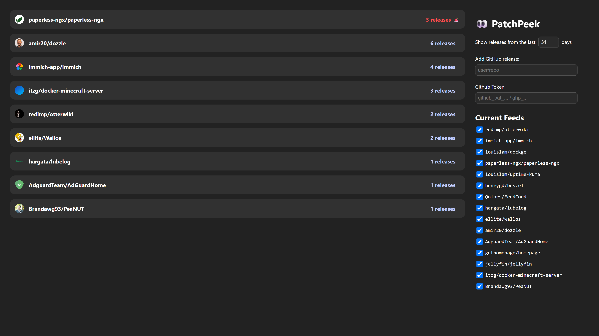

# 👀 PatchPeek (WIP)

PatchPeek fetches the changelog of GitHub releases with the GitHub API, while checking for any potential breaking changes and puts it into a clean interface.



This project came to fruition from me wanting to quickly know if any updates I were to do to my docker containers would break anything. I have used RSS feeds and the likes but they all felt too cumbersome to quickly check.

## IMPORTANT INFO

- It is recommended to not show releases from more then 90 days or so. This is quite a simple javascript application, so the backend isn't as robust to show a lot further then that. I have not thoroughly tested it on how far back it can go while being stable. This app was intended to be used every month when I personally update all my containers.

- The app pulls releases from the GitHub API every 1 hour, and caches it based on the `If-None-Match` request header. This is to use less requests from the API then needed. Considering it only uses the API once every hour, running the app without a GitHub token should provide enough requests for your needs. Of course, adding one is available.

## Docker

Instructions here. Docker is still a bit WIP.

## Locally running / Development

> [!NOTE]
> This project requires at least `Node 18`

- Clone the repo
- Open a terminal in the `PatchPeek` folder
- Then run:

```
npm install
npm start
```
