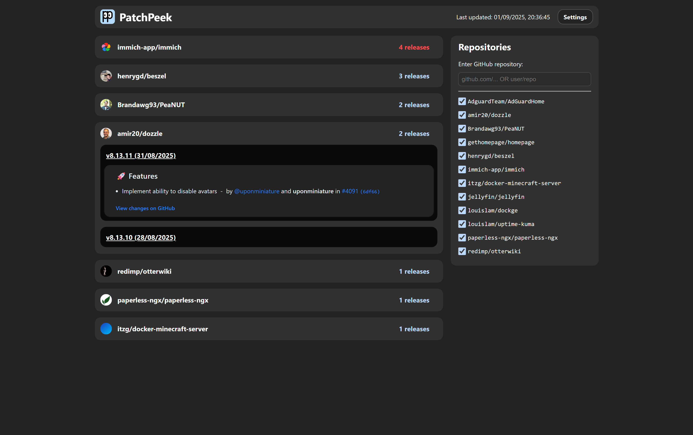

# PatchPeek

Fetches Github Releases changelog with API and it will check for any potential breaking changes. Mostly useful for checking for docker container updates before breaking something.

## Future additions:

- Add caching?
- put github token in config when building app

## Screenshot



## Running

Clone the repo

Create a `.env` file with

```
GITHUB_TOKEN=YOUR_TOKEN_HERE
```

Then run

```
npm start
```
